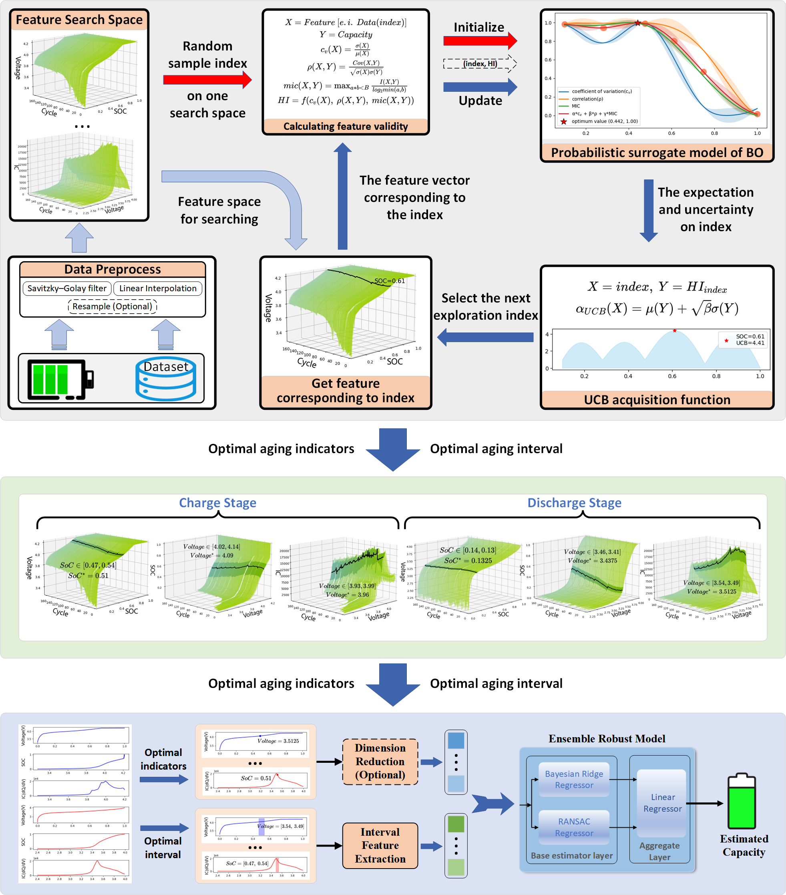

# Battery Feature Index Search （2024）

[Download Flowchart PDF file](fig/BO_feature.pdf)

# Battery Datasets

| Data  Source | Chemistry of cathode | Nominal capacity and end of life(EOL) | Degration Characteristics |
| :--------- | :---------: | :---------: | :---------: |
| [NASA](https://www.nasa.gov/content/prognostics-center-of-excellence-data-set-repository) | NCA | 2Ah/1.4Ah | Linear, Capacity recover |

# Acknowledge

